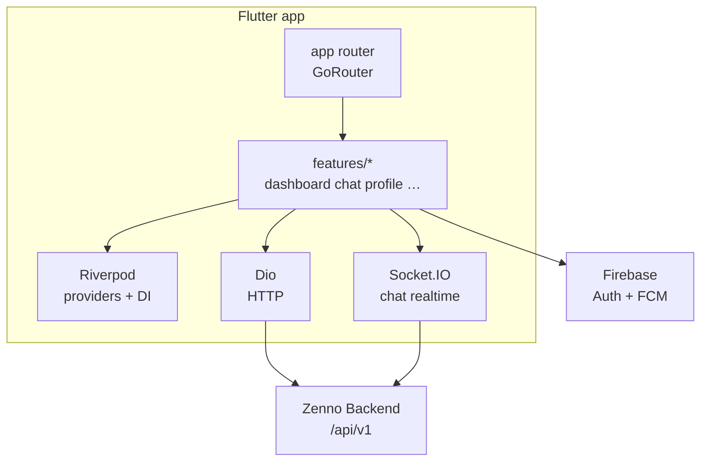

# Zenno Mobile App

Zenno Mobile App is the Flutter client for the Zenno platform. It provides authenticated access to developer analytics, project insights, profile management, chat, and notifications on Android devices.

## Product Overview

Zenno helps developers understand productivity patterns and improve focus/wellbeing. The mobile app is the portable companion to the desktop and web experiences, enabling users to:

- sign in and manage account/profile data
- view personal analytics and trend summaries
- inspect project and skills insights
- receive nudges and push notifications
- chat with peers in real time

The app consumes Zenno backend APIs and uses Firebase for authentication/messaging integration.

## Core Features

### Authentication and Session

- Firebase auth integration (email/password and social providers via backend flow)
- persistent session state
- route guards and onboarding-aware navigation

### Analytics Experience

- dashboard key metrics and trend visualizations
- app/language breakdowns
- skills/projects detail views
- project-level drill-down pages

### Profile and Social

- profile view/edit flows
- public profile browsing
- peers search/discovery

### Chat and Notifications

- conversation and thread screens
- Socket.IO-based real-time updates
- Firebase Cloud Messaging + local notification presentation
- users can **report** a conversation for moderation; **reviewing reports** is done in the **Zenno website admin console** (`/admin/chat-reports`) by accounts with `isAdmin` in the backend (not in the mobile app UI)

### Agent and Settings

- agent-related preference screens
- notification and app-level settings controls

## Tech Stack

- Flutter (Dart)
- Riverpod (state management and dependency injection)
- Dio (HTTP client)
- Firebase Core/Auth/Messaging
- GoRouter (routing)
- Socket.IO client (chat realtime)

## Repository Structure

- `lib/main.dart` - app bootstrap, `.env` load, Firebase init
- `lib/app/` - app shell, router, theme
- `lib/core/` - config, networking, providers, shared utilities/widgets
- `lib/features/` - feature modules (auth, dashboard, analytics, chat, profile, notifications, settings, peers, projects, agent)
- `lib/shared/` - cross-feature models/widgets
- `assets/` - app assets/icons
- `android/` - Android platform configuration

## Architecture



## Prerequisites

- Flutter SDK (matching Dart `^3.11.5`)
- Android Studio / Android SDK
- Running Zenno backend API
- Firebase project configured for Android app

## Environment Configuration

The app reads runtime config using this precedence:

1. `--dart-define=KEY=...`
2. `.env` values loaded by `flutter_dotenv`
3. hard-coded fallback in `EnvConfig`

Create local env file:

```powershell
Copy-Item .env.example .env
```

### Required Variables

- `API_BASE_URL` - backend base URL (`/api/v1` is auto-appended when missing)
- `ENV` - `dev` or `prod`

`ENV=dev` enables verbose networking logs via app config.

## Local Development

1. Install dependencies:

   ```powershell
   flutter pub get
   ```

2. Configure `.env` from `.env.example`.

3. Run app:

   ```powershell
   flutter run
   ```

Useful target examples:

```powershell
# Android emulator
flutter run -d emulator-5554

# Physical Android device
flutter run -d <device-id>
```

## Build Commands

```powershell
# Debug APK
flutter build apk --debug

# Release APK
flutter build apk --release
```

For CI/release without bundled `.env`, pass values through `--dart-define`:

```powershell
flutter build apk --release `
  --dart-define=API_BASE_URL=https://api.example.com `
  --dart-define=ENV=prod
```

## Firebase Notes

- Firebase is initialized in `lib/main.dart` using `lib/firebase_options.dart`.
- FCM background handler is registered at startup.
- Ensure Android Firebase app configuration aligns with your package/app IDs.

## Networking and API Integration

- API base URL normalization lives in `lib/core/config/env_config.dart`.
- `apiBaseUrl` always resolves to a `/api/v1` URL.
- `socketOrigin` is derived from the base URL to avoid malformed Socket.IO origins.

## Security Best Practices

- Never commit real `.env` values.
- Keep Firebase/API restrictions enabled in production environments.
- Rotate credentials if exposed.
- Avoid logging sensitive payloads/tokens in release builds.

## Troubleshooting

- **Cannot connect to backend**: verify `API_BASE_URL` and backend availability.
- **Auth/Firebase errors**: verify Firebase project config and Android app setup.
- **Push not received**: confirm notification permission, token registration, and backend notification endpoints.
- **Socket chat issues**: verify backend socket namespace and `socketOrigin` resolution.

---

Last Updated: 2026-05-01
